README

COOKING FOR TWO
By Ari Friedgut and Alex Baulderstone

Description
****************************
Can't decide what to cook for your date?
Cooking For Two is a terminal app that allows you to impress a special someone in your life with delicious date night recipes for a variety of situations! Whether you want to make a meal, a dessert or simply a light snack, Cooking For Two has the recipe for you!
Cooking For Two takes into account your date's dietary preferences, with options for vegans and people who are gluten intolerant.
STRETCH GOAL -
If you don't like a recipe, let us know and we will never suggest it to you again! If you LOVE a recipe, tell us and it will be added to your favourites!
ANOTHER STRETCH GOAL - 
We would like to implement a feature that writes the ingredients to a text file that can then be used as the user's shopping list.

Instructions
****************************
1. In terminal, make sure you are in the directory that houses the program.
2. type "cd src" to take you to the source code files so you can run the program.
3. Run the program by typing "ruby index.rb"
4. Answer the prompt for your name by typing in your name.
5. Answer the following prompts by typing 'yes' or 'no'.
6. Receive the perfect recipe for date night!

Screenshots of the Program
****************************
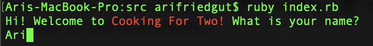

Screenshots of the Code
****************************
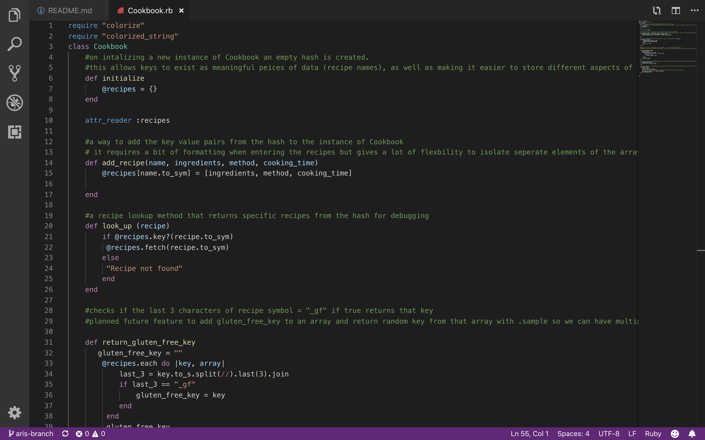
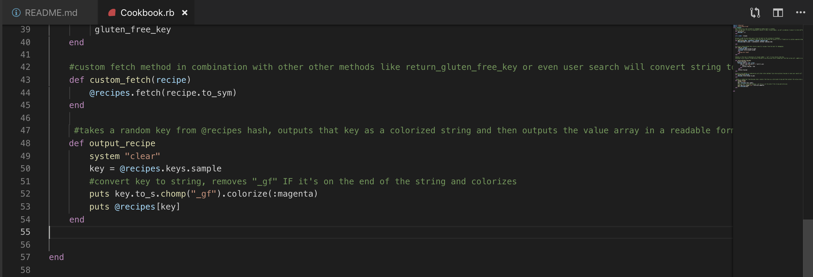
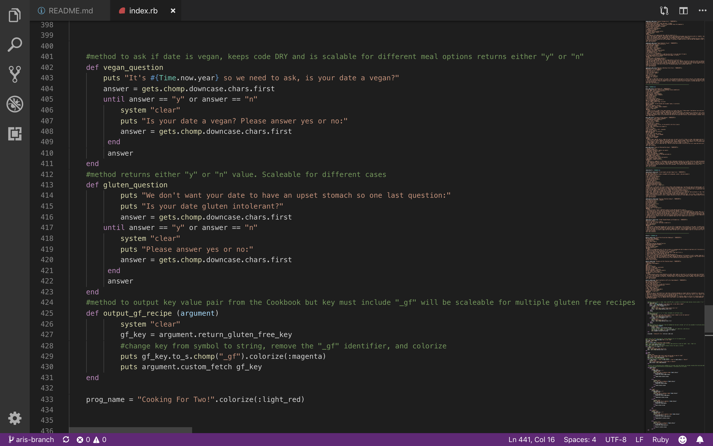
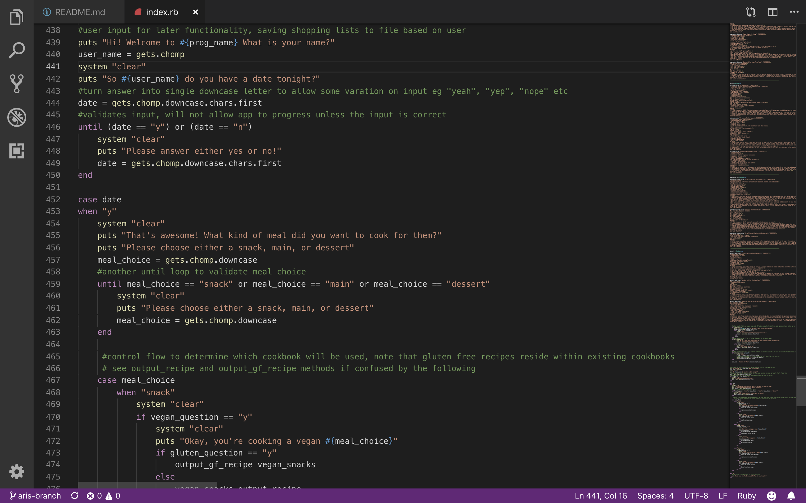
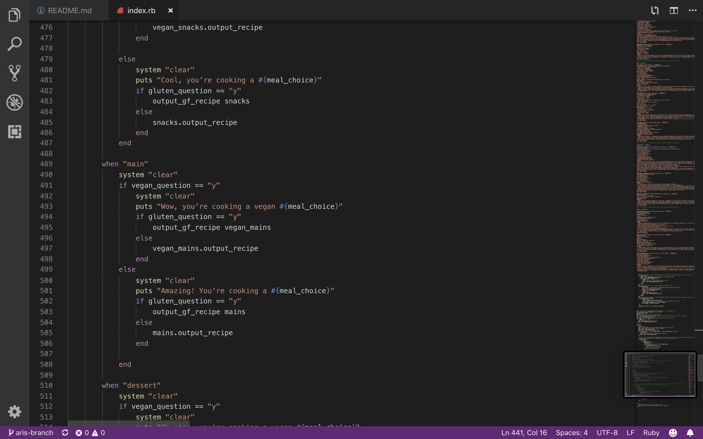
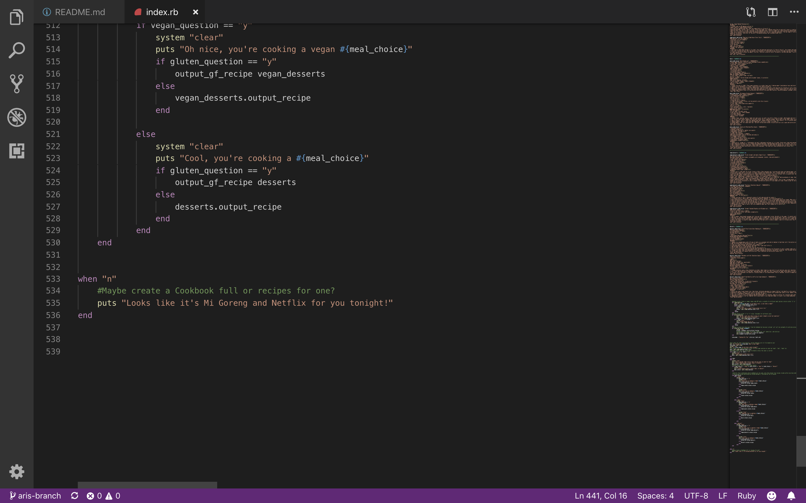

PLANNING
****************************

After iterating through a couple ideas in a brainstorm,
[brainstorm](docs/brainstorm.jpg)  
We decided to work on an app that draws on a database of recipes and outputs a recipe that will be suitable for the user.
Initially we thought it might be nice if the app starts by asking the user how many people they are cooking for
  
but then we decided that since we only have two days to create this app it would be necessary to simplify the concept. We did so by deciding the app would be for people who are cooking for a date.

The name "Cooking For Two" emerged naturally from this process, and we drew up a rough flow chart indicating how the app would run.

After we had our rough idea, we wrote three user stories. These can be seen on our trello board but are also attached below.

The user stories helped focus our idea, and we created a flow chart as the basis for our app.

After this, we sourced recipes from the internet
[Vegan Flourless Chocolate Cake](https://www.mydarlingvegan.com/vegan-flourless-chocolate-cake/)  
[Spicy Tuna Cucumber Bites](https://paleoleap.com/spicy-tuna-cucumber-bites/)  
[Pancakes with Hot Chocolate Sauce](https://www.delicious.com.au/recipes/pancakes-hot-chocolate-sauce/308b48fc-38e5-40ad-8de4-689309f80315?current_section=recipes)  
[Pea and Ham Croquettes](https://www.delicious.com.au/recipes/pea-ham-croquettes-fiery-aioli/37b88a9b-94a5-45fb-9b75-17f5c7459ef7?current_section=recipes&r=recipes/collections/70recipesforaromanticdatenightathome)  
[Gluten Free Sticky Date Pudding](https://www.stayathomemum.com.au/recipes/gluten-free-sticky-date-pudding/)  
[Deep Fried Nutella Jaffle Ice Cream Sandwich](https://www.delicious.com.au/recipes/deep-fried-nutella-jaffle-ice-cream-sandwich/9599620b-6b11-421a-8d41-2d02dbb0f04b)  
[Portuguese Chicken Burger](https://www.delicious.com.au/recipes/portuguese-chicken-burger/2e78ba2a-2ff8-41f8-9aa6-6bc2938bc481)  
[Crispy Sweet Potato Bites](https://www.delicious.com.au/recipes/crispy-sweet-potato-paleo-nachos/21bfb87e-899d-4dc8-914c-39cf0e32a345)  
[Steak Mushroom Miso Sauce](https://www.delicious.com.au/recipes/steak-mushroom-miso-sauce/55fdf112-af32-4e95-a13f-80b3220ed9e5?current_section=recipes)  
[Crisp-Fried Cheese Ravioli](https://www.delicious.com.au/recipes/crisp-fried-cheese-ravioli/2090fe76-9b7b-4095-89bc-8ea0d8b5c751?current_section=recipes)  
[Vegan Shepherds Pie](https://jessicainthekitchen.com/vegan-shepherds-pie-gluten-free/)  
[Coconut Chickpea Curry](https://jessicainthekitchen.com/coconut-chickpea-curry-recipe/)  
[Beetroot and Red Onion Tarte-Tatin](https://www.bbcgoodfood.com/recipes/beetroot-red-onion-tarte-tatin)  
[Simple Vegan Hummus Quesadillas](https://www.thissavoryvegan.com/simple-vegan-hummus-quesadillas/)  
[Vegan Nacho Cheese Sauce](https://happyhealthymama.com/vegan-nacho-cheese-sauce.html)  
[Smashed Chickpea Bruschetta](https://www.taste.com.au/recipes/smashed-chickpea-bruschetta/modwcwx4)  
[Sticky Caramel Apple Vegan Slice](https://www.taste.com.au/recipes/sticky-caramel-apple-vegan-slice/)  
[Caramel Poached Peaches with Blueberries](https://www.bbcgoodfood.com/recipes/2120/caramel-poached-peaches-with-blueberries)  

Our aim is to ultimately include the recipes into different hashes for each branch. This is how we envisioned it.

As all this was happening, we were uploading our plans to a shared Trello board we created

as well as keeping up constant communication via Slack.

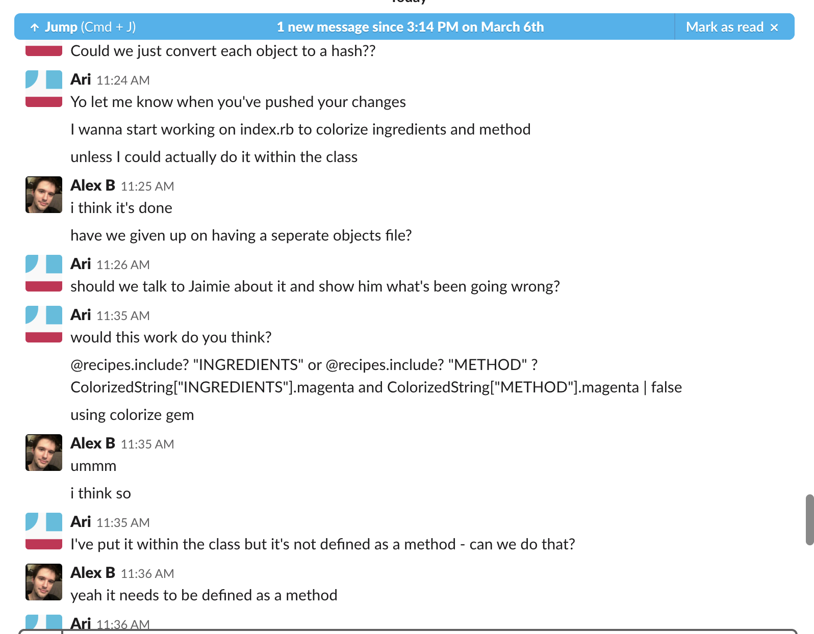
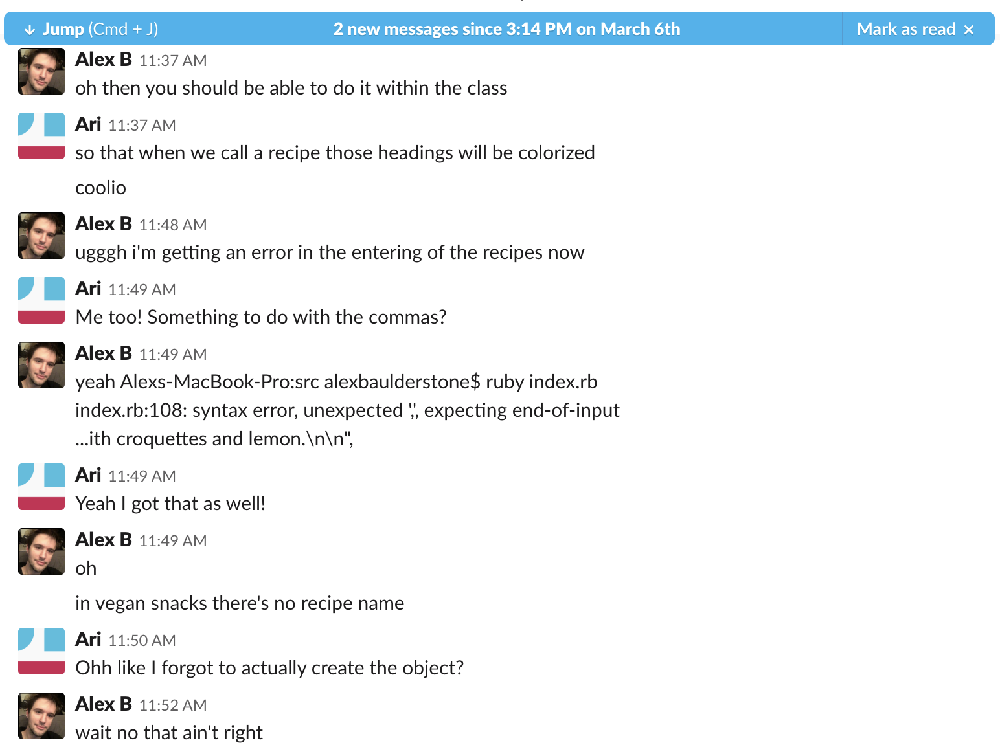
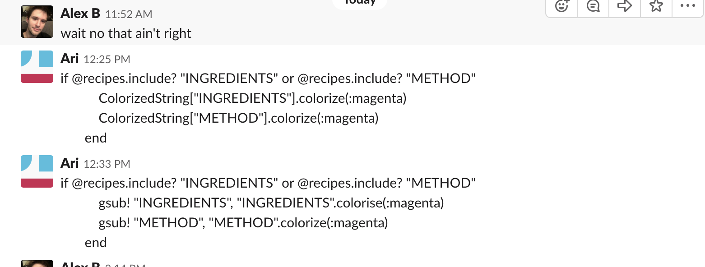

There were three documents to put together
- a parent Cookbook class
- different objects based on the meal requirements
- an index.rb file from which our program would run

MORE TRELLO SCREENSHOTS  
[link 1](docs/trello_1.jpg)  
[link 2](docs/trello_2.jpg)  
[link 3](docs/trello_3.jpg)  

FLOWCHART
****************************
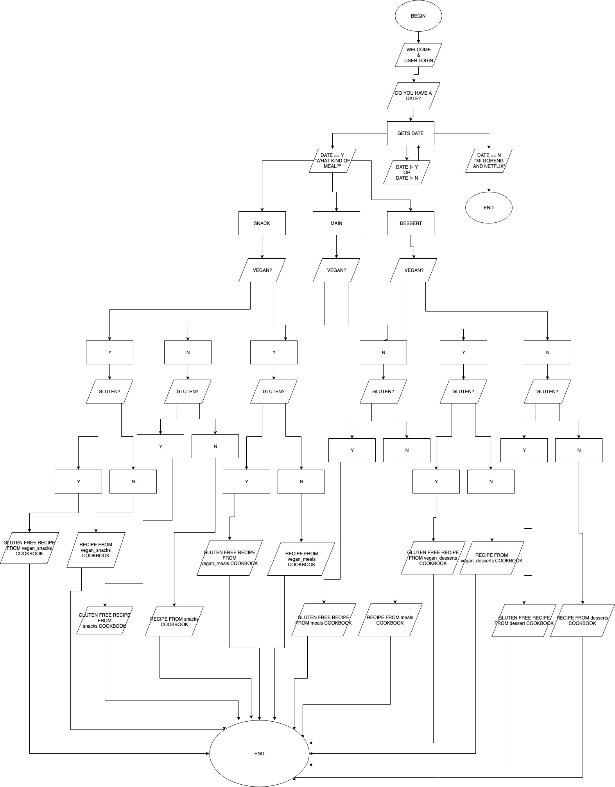

Timeline
****************************
Brainstorm - 1.5 hr
Planning - 3 hr
Coding (Cookbook class) - 4 hr
Coding (Objects) - 1.5 hr
Coding (index.rb) - 4 hr
README.md - 2 hr

Ethical and moral concerns
****************************
The app could potentially be isolating to single people, especially in its current iteration where there's no option for single serving meals. In the future this could be changed to be a bit more sensitive. Although why you'd use an app called cooking for two to find a meal for one is beyond us. 
As this is an open source project it's possible that someone could add non vegan recipes to vegan cookbooks or to add recipes that don't conform to some other criteron 
At this stage in development the app doesn't cater to any more diet types and there are a lot of culturally significant dietary choices (halal, kosher, etc ) that aren't being catered for. There's potential for users to be offended or perhaps unwittingly offend their date by cooking the wrong type of meal 