README

Description
****************************
Can't decide what to cook for your date?
Cooking For Two is a terminal app that allows you to impress a special someone in your life with delicious date night recipes for a variety of situations! Whether you want to make a meal, a dessert or simply a light snack, Cooking For Two has the recipe for you!
Cooking For Two takes into account your date's dietary preferences, with options for vegans and people who are gluten intolerant.
If you don't like a recipe, let us know and we will never suggest it to you again! If you LOVE a recipe, tell us and it will be added to your favourites!

Instructions
****************************

Planning
****************************
After iterating through a couple ideas in a brainstorm,

We decided to work on an app that draws on a database of recipes and outputs a recipe that will be suitable for the user.
Initially we thought it might be nice if the app starts by asking the user how many people they are cooking for
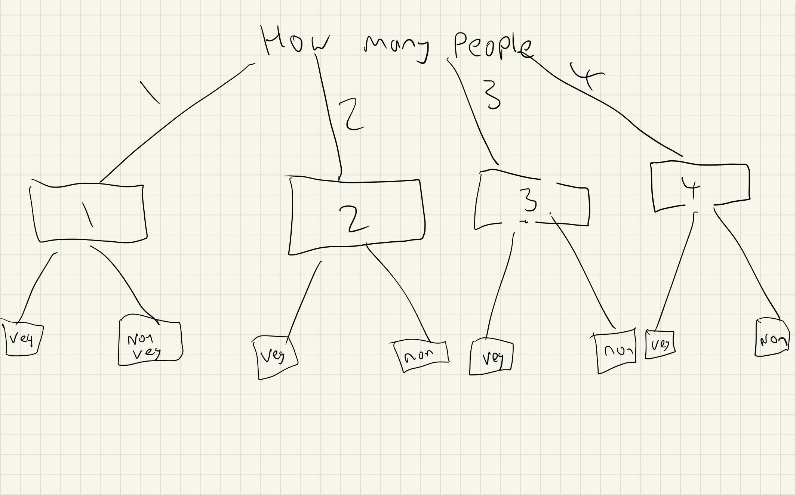
but then we decided that since we only have two days to create this app it would be necessary to simplify the concept. We did so by deciding the app would be for people who are cooking for a date.

The name "Cooking For Two" emerged naturally from this process, and we drew up a rough flow chart indicating how the app would run.
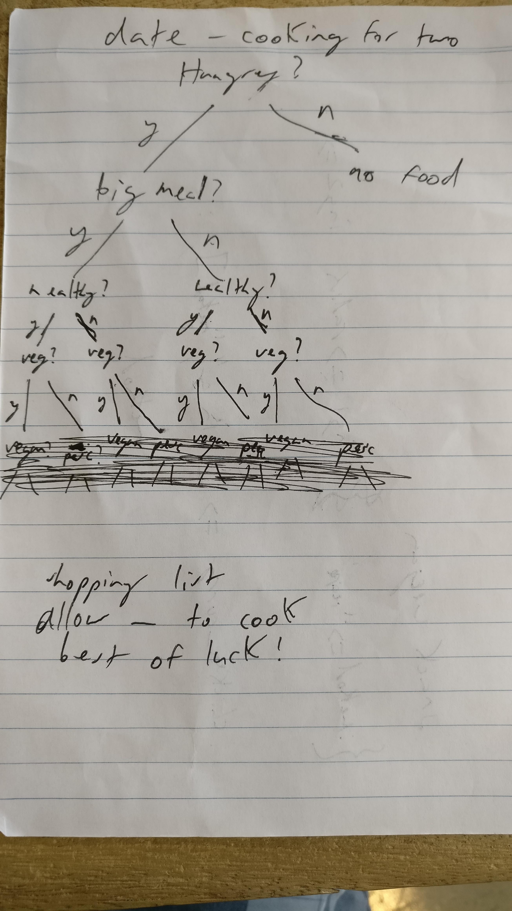

After we had our rough idea, we wrote three user stories. These can be seen on our trello board but are also attached below.
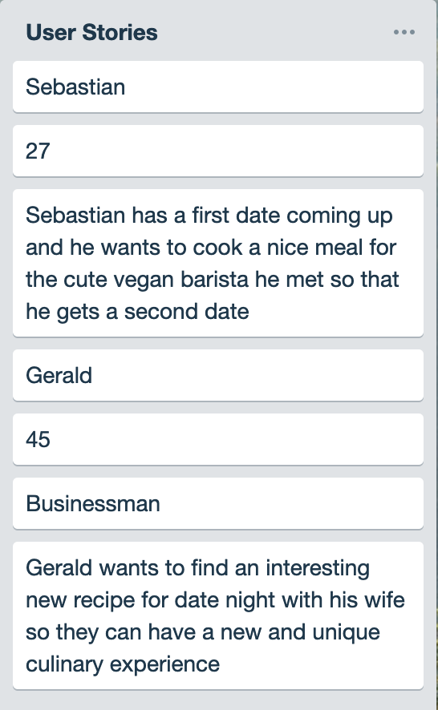
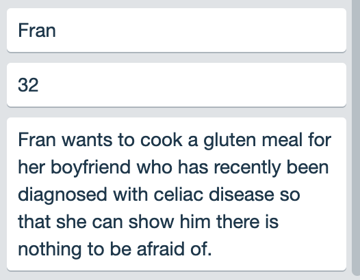

The user stories helped focus our idea, and we created a flow chart as the basis for our app.
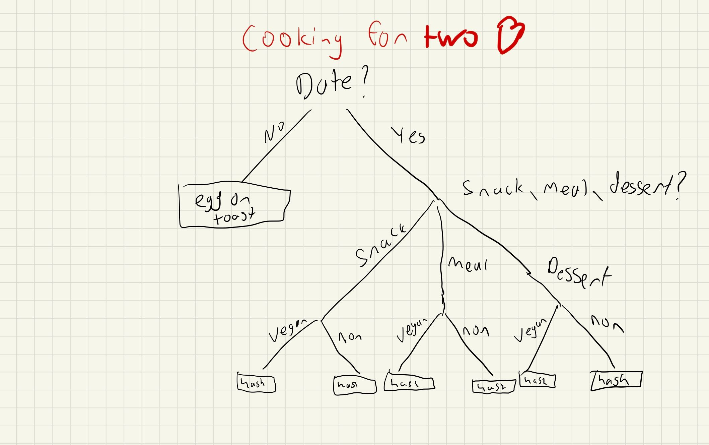

After this, we sourced recipes from the internet
[Vegan Flourless Chocolate Cake\n](https://www.mydarlingvegan.com/vegan-flourless-chocolate-cake/)
[Spicy Tuna Cucumber Bites\n](https://paleoleap.com/spicy-tuna-cucumber-bites/)
[Pancakes with Hot Chocolate Sauce\n](https://www.delicious.com.au/recipes/pancakes-hot-chocolate-sauce/308b48fc-38e5-40ad-8de4-689309f80315?current_section=recipes)
[Pea and Ham Croquettes\n](https://www.delicious.com.au/recipes/pea-ham-croquettes-fiery-aioli/37b88a9b-94a5-45fb-9b75-17f5c7459ef7?current_section=recipes&r=recipes/collections/70recipesforaromanticdatenightathome)
[Gluten Free Sticky Date Pudding\n](https://www.stayathomemum.com.au/recipes/gluten-free-sticky-date-pudding/)
[Deep Fried Nutella Jaffle Ice Cream Sandwich\n](https://www.delicious.com.au/recipes/deep-fried-nutella-jaffle-ice-cream-sandwich/9599620b-6b11-421a-8d41-2d02dbb0f04b)
[Portuguese Chicken Burger\n](https://www.delicious.com.au/recipes/portuguese-chicken-burger/2e78ba2a-2ff8-41f8-9aa6-6bc2938bc481)
[Crispy Sweet Potato Bites\n](https://www.delicious.com.au/recipes/crispy-sweet-potato-paleo-nachos/21bfb87e-899d-4dc8-914c-39cf0e32a345)
[Steak Mushroom Miso Sauce\n](https://www.delicious.com.au/recipes/steak-mushroom-miso-sauce/55fdf112-af32-4e95-a13f-80b3220ed9e5?current_section=recipes)
[Crisp-Fried Cheese Ravioli\n](https://www.delicious.com.au/recipes/crisp-fried-cheese-ravioli/2090fe76-9b7b-4095-89bc-8ea0d8b5c751?current_section=recipes)
[Vegan Shepherds Pie\n](https://jessicainthekitchen.com/vegan-shepherds-pie-gluten-free/)
[Coconut Chickpea Curry\n](https://jessicainthekitchen.com/coconut-chickpea-curry-recipe/)
[Beetroot and Red Onion Tarte-Tatin\n](https://www.bbcgoodfood.com/recipes/beetroot-red-onion-tarte-tatin)
[Simple Vegan Hummus Quesadillas\n](https://www.thissavoryvegan.com/simple-vegan-hummus-quesadillas/)
[Vegan Nacho Cheese Sauce\n](https://happyhealthymama.com/vegan-nacho-cheese-sauce.html)
[Smashed Chickpea Bruschetta\n](https://www.taste.com.au/recipes/smashed-chickpea-bruschetta/modwcwx4)
[Sticky Caramel Apple Vegan Slice\n](https://www.taste.com.au/recipes/sticky-caramel-apple-vegan-slice/)
[Caramel Poached Peaches with Blueberries\n](https://www.bbcgoodfood.com/recipes/2120/caramel-poached-peaches-with-blueberries)

Our aim is to ultimately include the recipes into different hashes for each branch. This is how we envisioned it.
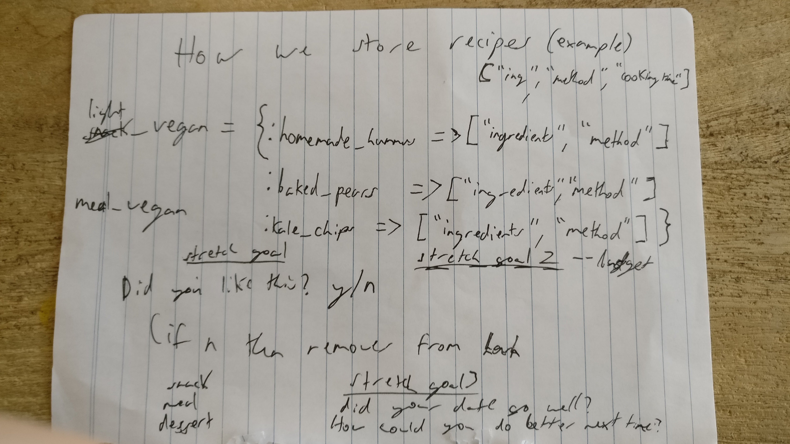

As this was happening, we were uploading our plans to a shared Trello board we created
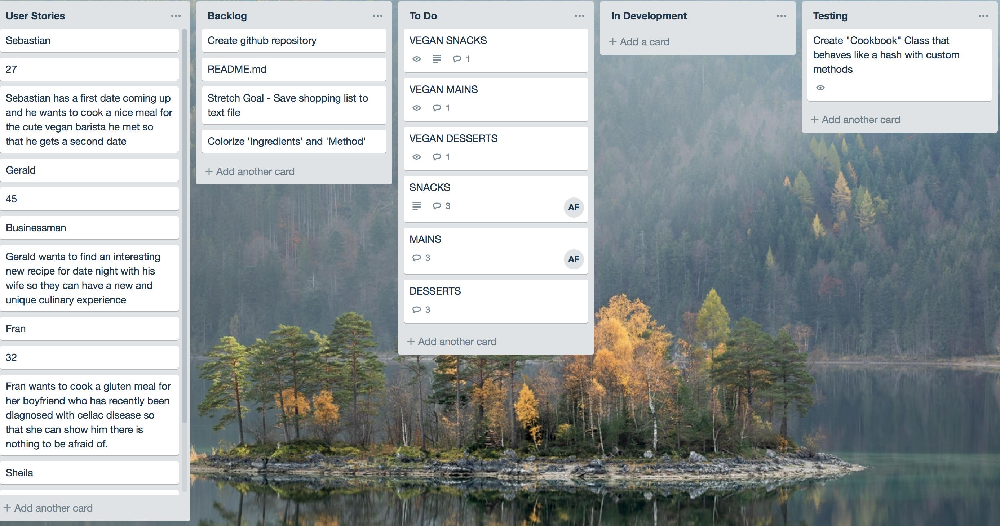

as well as keeping up constant communication via Slack.
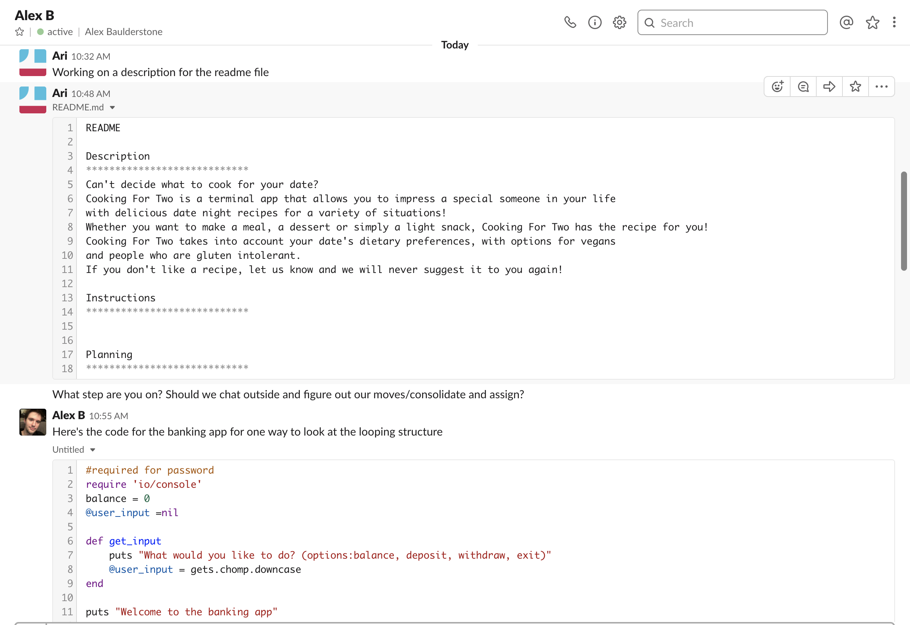
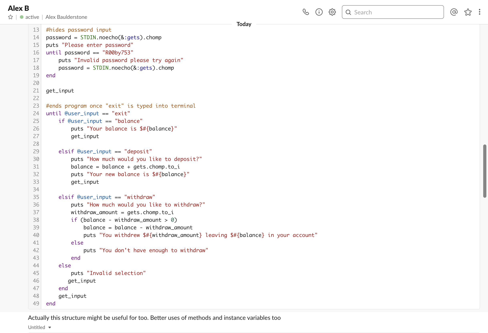
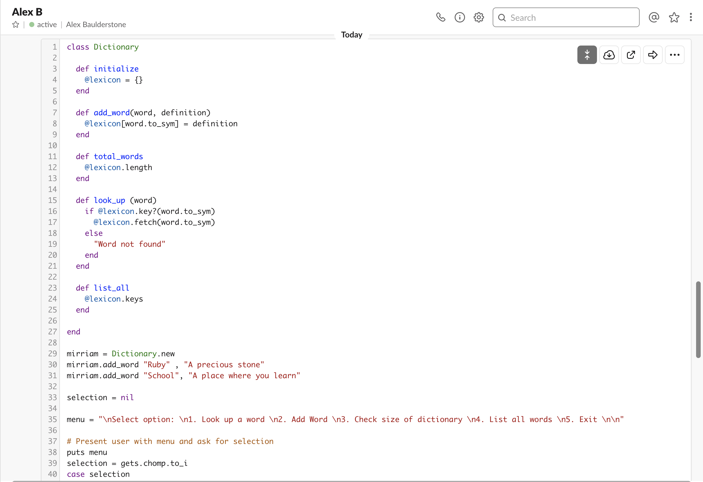
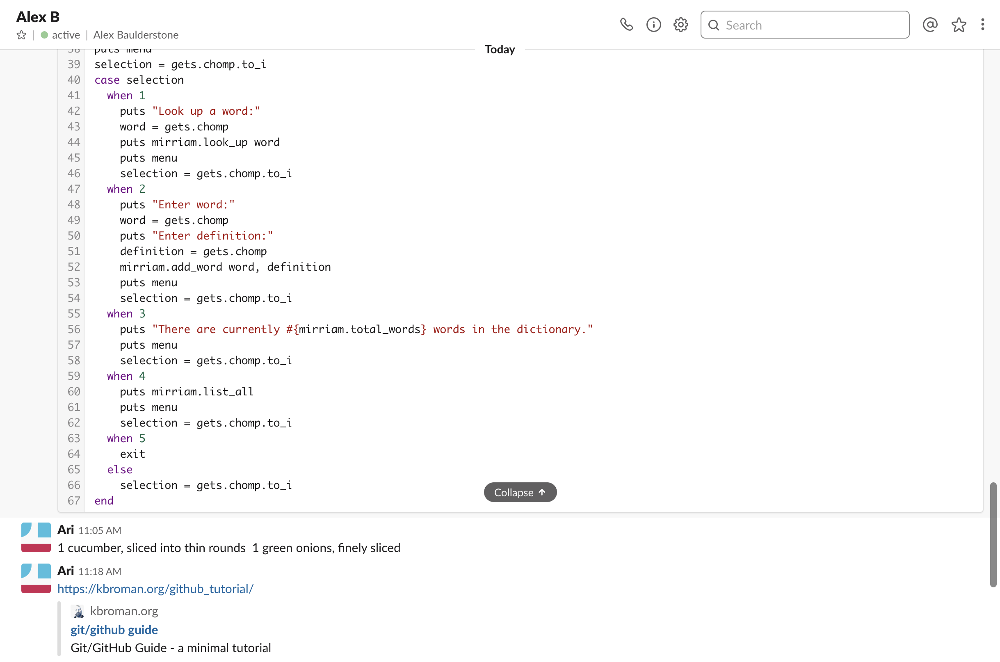
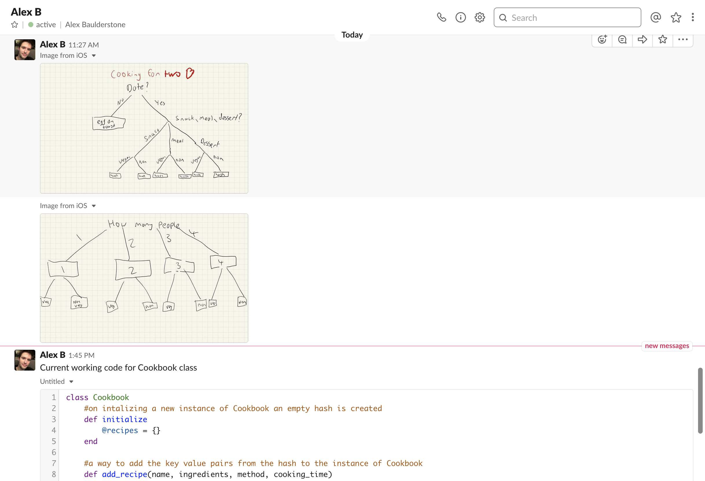

As Ari worked on the Description and Planning section of our README.md file, Alex put together a .rb doc that defined a Cookbook class.